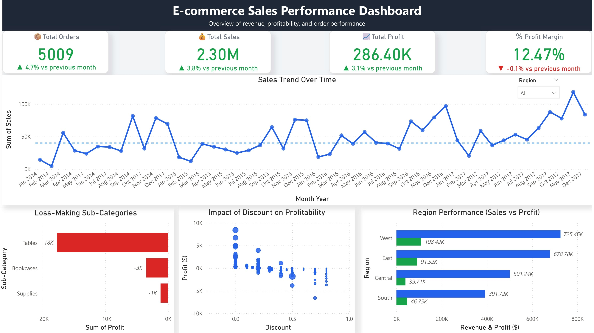

# 📊 Superstore Sales Analytics | SQL + Python + Excel + Power BI

## 📌 Project Overview

This is an end-to-end data analytics project analyzing e-commerce sales performance using SQL, Python, Excel, and Power BI. The project focuses on deriving actionable business insights related to revenue, profitability, customer behavior, and operational efficiency.

---

## 🎯 Objectives

* Analyze overall business performance (sales, profit, orders)
* Identify loss-making products and high-performing categories
* Understand customer and regional trends
* Evaluate the impact of discounts on profitability
* Build interactive dashboards for business decision-making

---

## 🧱 Project Workflow

```plaintext
Raw Dataset → Excel Analysis → SQL Data Modeling → Python EDA → Power BI Dashboard
```

---

## 📊 Excel Analysis (Business Understanding)

Performed initial analysis using Excel:

* Created pivot tables for sales and profit analysis
* Built a KPI dashboard for quick business insights
* Analyzed trends across regions, categories, and customers

📄 File: `excel/superstore_kpi_dashboard.xlsx`

---

## 🗄️ SQL (Data Modeling & Advanced Analysis)

* Designed a **star schema** with fact and dimension tables
* Created staging, customers, and orders tables
* Implemented data cleaning and transformation

📄 SQL File: 

### Key SQL Analysis:

* Overall business KPIs (Revenue, Profit, Orders)
* Monthly sales trends
* Category & sub-category performance
* Top customers by revenue
* Discount impact on profit margins
* Loss-making products analysis

---

## 🐍 Python (Exploratory Data Analysis)

Performed EDA using Python:

* Data cleaning and preprocessing
* Distribution analysis of sales and profit
* Correlation analysis
* Outlier detection
* Visualizations using Matplotlib and Seaborn

📄 Notebook: `python/Superstore_EDA.ipynb`

---

## 📊 Power BI Dashboard (Final Output)

Developed an interactive dashboard to visualize business performance:

### Key Features:

* KPI cards (Total Sales, Profit, Orders, Profit Margin)
* Sales trend over time
* Discount vs Profit analysis
* Regional performance comparison
* Loss-making sub-category identification

📸 Dashboard Preview:


---

## 📈 Key Insights

* High discounts negatively impact profitability
* Certain sub-categories consistently generate losses
* Sales exhibit seasonal trends over time
* Some regions generate high revenue but low profit margins

---

## 💡 Business Recommendations

* Optimize discount strategies to improve margins
* Focus on high-performing product categories
* Improve profitability in low-margin regions
* Reduce dependency on loss-making products

---

## 🛠️ Tools & Technologies

* Excel (Pivot Tables, KPI Dashboard)
* SQL (PostgreSQL)
* Python (Pandas, Matplotlib, Seaborn)
* Power BI (Data Visualization)
* Data Modeling

---

## 📂 Dataset

Superstore dataset (public dataset used for analytics practice)

---

## 🚀 How to Use

1. Explore Excel dashboard for quick insights
2. Run SQL scripts for structured analysis
3. Use Python notebook for deep data exploration
4. Open Power BI dashboard for interactive insights

---

## 👤 Author

Your Name
